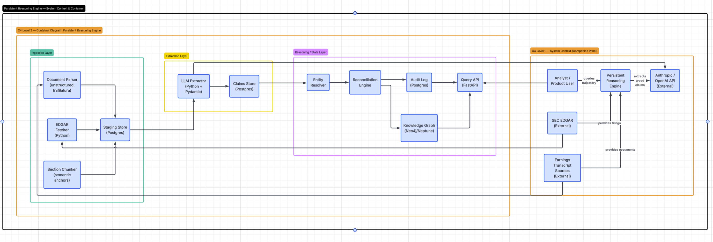

# SEC EDGAR — How It Works in This Project

EDGAR is the SEC’s public filing system. Our **`edgar_fetcher`** service uses it only to **discover and download** raw filing files. EDGAR does not parse, chunk, extract, or update the knowledge graph.



---

## What EDGAR is

**EDGAR** = **E**lectronic **D**ata **G**athering, **A**nalysis, and **R**etrieval.

When Microsoft files a 10-K, the SEC stores the HTML/PDF and indexes metadata (company, date, form type, accession number). EDGAR is that index + file store.

---

## Inputs to our EDGAR integration

These are **what we send** to SEC endpoints (not what EDGAR “returns” as input):

| Input | Example | Where it comes from |
|-------|---------|---------------------|
| **Ticker** | `MSFT` | Pipeline CLI `--ticker MSFT` |
| **CIK** | `0000789019` | Mapped from ticker in `edgar_fetcher/service.py` |
| **Form filter** | `10-K` | Code filters submissions list |
| **User-Agent header** | `FinancialPersistentReasoning you@example.com` | Required by SEC; set via `SEC_USER_AGENT` in `.env` |

There is **no API key**. SEC requires a descriptive `User-Agent` with contact info.

---

## SEC endpoints we call

### 1. Company submissions (metadata)

**Purpose:** List recent filings for a company.

```http
GET https://data.sec.gov/submissions/CIK0000789019.json
User-Agent: FinancialPersistentReasoning you@example.com
```

**Implemented in:** `fetch_submissions()` in `services/layer1_ingestion/edgar_fetcher/service.py`

**JSON response (relevant fields):**

```json
{
  "name": "MICROSOFT CORP",
  "cik": "0000789019",
  "tickers": ["MSFT"],
  "filings": {
    "recent": {
      "accessionNumber": ["0000950170-24-087843", "..."],
      "form": ["10-K", "10-Q", "8-K", "..."],
      "filingDate": ["2024-07-30", "..."],
      "primaryDocument": ["msft-20240630.htm", "..."]
    }
  }
}
```

**How we use it:**

1. Loop `filings.recent.form` until we find `"10-K"`.
2. Read matching `accessionNumber`, `filingDate`, `primaryDocument`.
3. Build the Archives download URL (next step).
4. Insert one row into **`staging.documents`** (Postgres).

We do **not** pass this JSON to the LLM or Neo4j. It is a **catalog lookup** only.

---

### 2. Filing document download (raw file)

**Purpose:** Download the actual 10-K HTML (or PDF).

```http
GET https://www.sec.gov/Archives/edgar/data/789019/000095017024087843/msft-20240630.htm
User-Agent: FinancialPersistentReasoning you@example.com
```

**URL pattern:**

```
https://www.sec.gov/Archives/edgar/data/{cik_numeric}/{accession_no_dashes}/{primaryDocument}
```

Example built in code:

```python
source_url = (
    f"https://www.sec.gov/Archives/edgar/data/{cik_short}/"
    f"{accession_path}/{primary}"
)
```

**Implemented in:** `download_filing()` → saves bytes to `data/raw/MSFT/doc-msft-10k-2024.html`

**Response body:** Raw HTML (often 500+ pages, tables, XBRL tags, inline styles).

**How we use it:**

| Consumer | Action |
|----------|--------|
| **`staging.documents`** | Store `source_url`, `raw_path`, `filing_date`, `accession_number` |
| **`document_parser`** | Read `raw_path` → strip HTML → clean text |
| **`section_chunker`** | Split clean text by Item 1 / 1A / 7 / 8 → `staging.chunks` |
| **`llm_extractor`** | Reads chunk **text** from Postgres (never the raw URL again) |
| **`query_api`** | Provenance joins back to `source_url` for citations |

EDGAR output **never goes directly** to Layer 2 or Layer 3. It always passes through **parse → chunk** first.

---

### 3. Other EDGAR endpoints (not used in v1)

| Endpoint | Purpose | v1 status |
|----------|---------|-----------|
| `https://www.sec.gov/files/company_tickers.json` | Ticker → CIK map | Hardcoded for MSFT/AMZN |
| `https://data.sec.gov/api/xbrl/companyfacts/CIK....json` | Structured XBRL facts | Future — could feed Active States |
| Full-text search API | Search filings | Not used |

---

## Output summary: what EDGAR returns vs what we produce

| Stage | EDGAR / fetcher output | Stored where | Next service |
|-------|------------------------|--------------|--------------|
| Submissions API | JSON filing list | Not stored (ephemeral) | Used to pick accession + URL |
| Archives GET | Raw `.htm` file | `data/raw/{TICKER}/` + `staging.documents` | `document_parser` |
| After parser | Clean text string | In memory | `section_chunker` |
| After chunker | Section rows | `staging.chunks` | `llm_extractor` |
| After LLM | Typed claims | `extraction.claims` | `reconciliation_engine` |
| After reconcile | Graph + audit | Neo4j + `state_transitions` | `query_api` |

---

## Flow within the service (EDGAR → graph)

```
Pipeline: python -m pipeline.orchestrator --edgar --ticker MSFT

┌─────────────────────────────────────────────────────────────────┐
│ edgar_fetcher                                                   │
│   IN:  ticker MSFT, SEC User-Agent                              │
│   CALL: data.sec.gov/submissions/CIK0000789019.json               │
│   CALL: sec.gov/Archives/edgar/data/.../msft-20240630.htm       │
│   OUT: staging.documents row + data/raw/MSFT/*.html               │
└────────────────────────────┬────────────────────────────────────┘
                             │ raw_path
┌────────────────────────────▼────────────────────────────────────┐
│ document_parser                                                 │
│   IN:  raw HTML file                                            │
│   OUT: cleaned plain text (not persisted)                       │
└────────────────────────────┬────────────────────────────────────┘
                             │ text
┌────────────────────────────▼────────────────────────────────────┐
│ section_chunker                                                 │
│   OUT: staging.chunks (Item 1, 1A, 7, …)                        │
└────────────────────────────┬────────────────────────────────────┘
                             │ SQL SELECT chunks
┌────────────────────────────▼────────────────────────────────────┐
│ llm_extractor                                                   │
│   OUT: extraction.claims                                        │
└────────────────────────────┬────────────────────────────────────┘
                             │
┌────────────────────────────▼────────────────────────────────────┐
│ reconciliation_engine + Neo4j                                   │
│   OUT: enterprise graph + state_transitions                     │
└─────────────────────────────────────────────────────────────────┘
```

---

## Sample vs live EDGAR

| Mode | Command | EDGAR called? |
|------|---------|---------------|
| **Sample (default)** | `python -m pipeline.orchestrator --ticker MSFT` | No — uses `data/samples/msft-10k-fy2024.html` via `ingest_from_local()` |
| **Live EDGAR** | `python -m pipeline.orchestrator --edgar --ticker MSFT` | Yes — both submissions + Archives endpoints |

Both paths produce the **same downstream shape** (`staging.documents` → chunks → claims → graph). Only the raw file source differs.

---

## `staging.documents` row (what fetcher writes)

After a successful EDGAR fetch:

| Column | Example |
|--------|---------|
| `doc_id` | `doc-msft-10k-2024` |
| `company_ticker` | `MSFT` |
| `company_cik` | `0000789019` |
| `doc_type` | `10-K` |
| `filing_date` | `2024-07-30` |
| `fiscal_period` | `FY2024` |
| `accession_number` | `0000950170-24-087843` |
| `source_url` | `https://www.sec.gov/Archives/edgar/data/789019/...` |
| `raw_path` | `data/raw/MSFT/doc-msft-10k-2024.html` |

This row is the **handoff** from EDGAR fetch to the rest of the pipeline.

---

## Code reference

| Function | File | SEC endpoint |
|----------|------|--------------|
| `fetch_submissions(cik)` | `edgar_fetcher/service.py` | `data.sec.gov/submissions/CIK{cik}.json` |
| `download_filing(url, dest)` | `edgar_fetcher/service.py` | `sec.gov/Archives/edgar/data/...` |
| `fetch_latest_10k(ticker)` | `edgar_fetcher/service.py` | Orchestrates both calls + Postgres insert |
| `ingest_from_local(...)` | `edgar_fetcher/service.py` | Skips SEC; same Postgres shape for dev |

---

## Related docs

- [ARCHITECTURE.md](../ARCHITECTURE.md) — full three-layer design
- [SERVICES.md](../SERVICES.md) — DB reads/writes per service
- [ReasoningEngineC4.png](ReasoningEngineC4.png) — C4 container diagram
